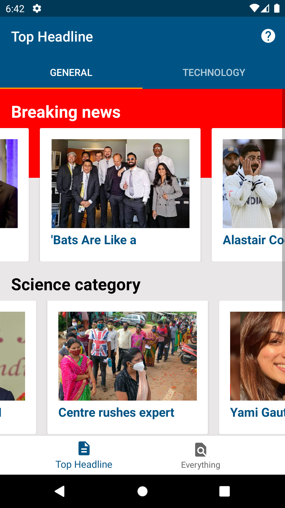
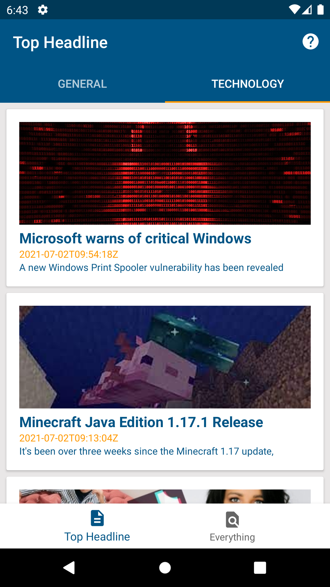

## Coding Test News Apps
- Mini Apps News For Requirement Android Programmer Job in 2019

## ScreenShot Apps
| UI 1 | UI 2 | UI 3 |
|:----:|:----:|:----:|
| |  |  |

## Colaborator
Very open to anyone, I'll write your name under this, please contribute by sending an email to me

- Mail To faisalamircs@gmail.com
- Subject : Github _ [Github-Username-Account] _ [Language] _ [Repository-Name]
- Example : Github_amirisback_kotlin_admob-helper-implementation

Name Of Contribute
- Muhammad Faisal Amir
- Waiting List
- Waiting List

Waiting for your contribute

## Source
- Google Sample Code [Click Here](https://github.com/googleads/googleads-mobile-android-examples)
- Test Ads [Click Here](https://developers.google.com/admob/android/test-ads)
- For Get Started [Click Here](https://developers.google.com/admob/android/quick-start)

## Attention !!!
Please enjoy and don't forget fork and give a star
- Don't Forget Follow My Github Account
